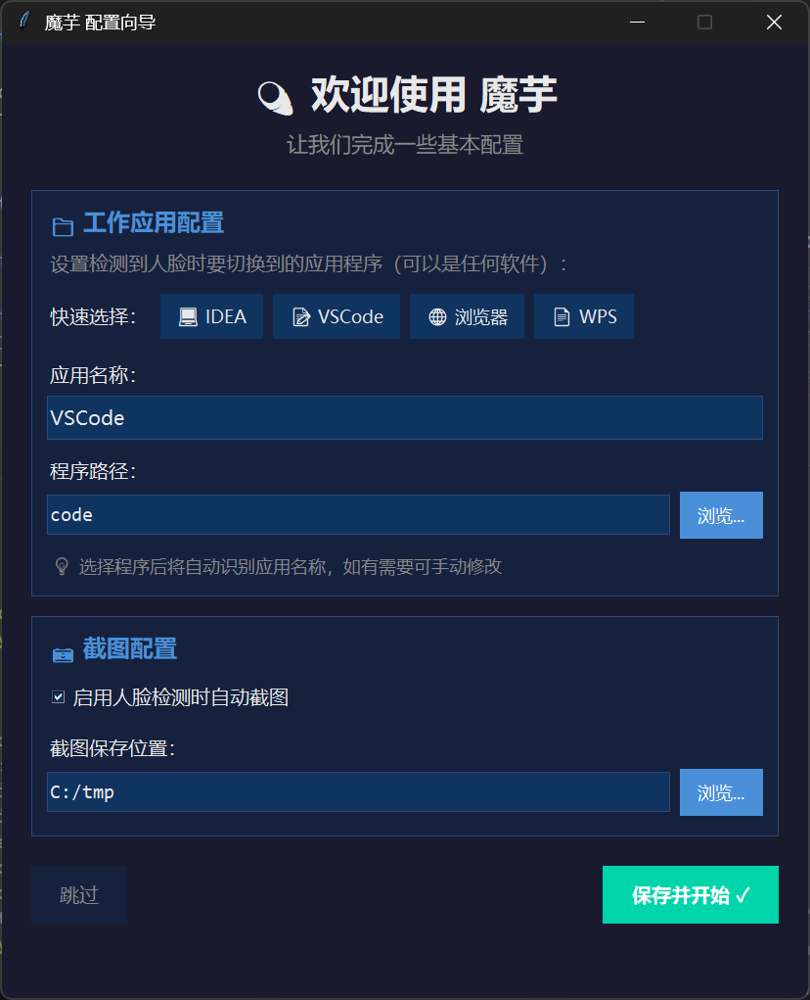
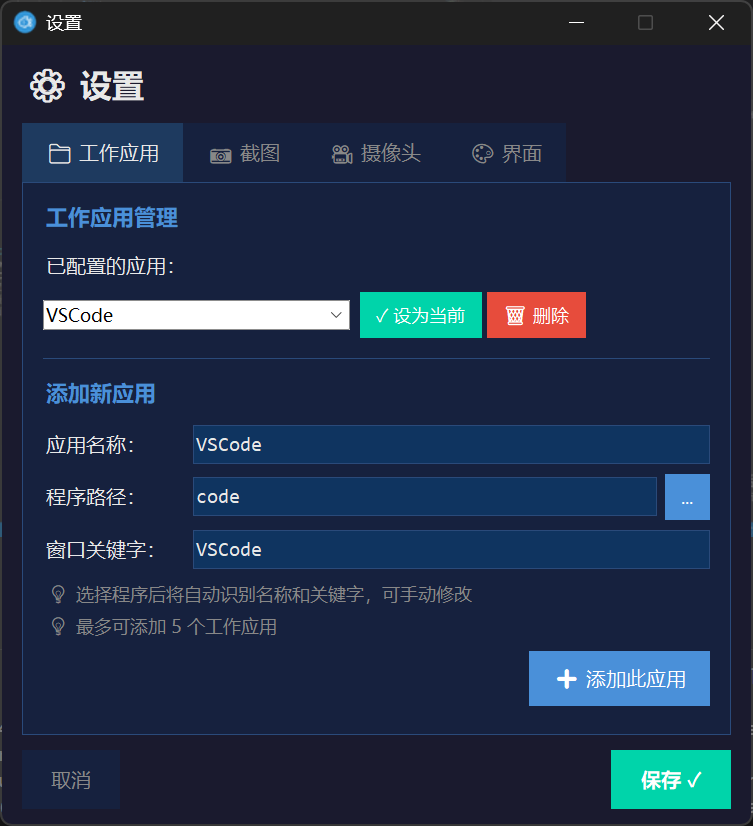
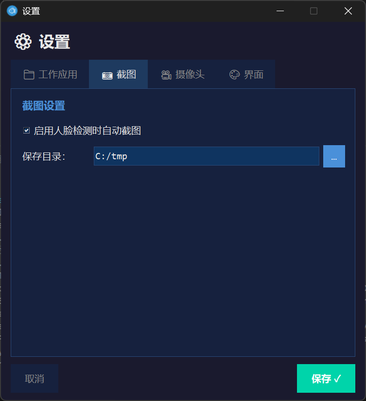
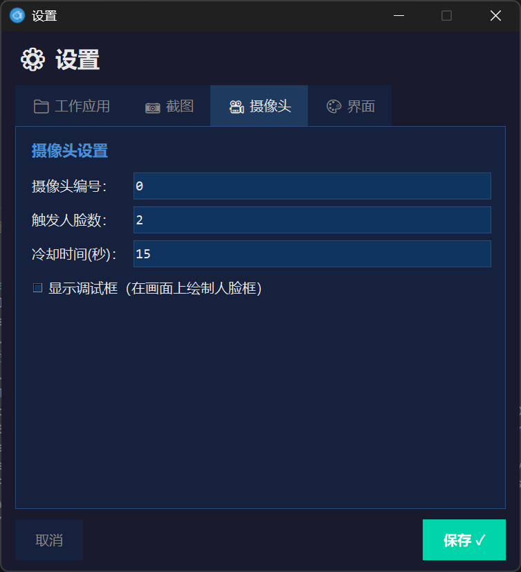
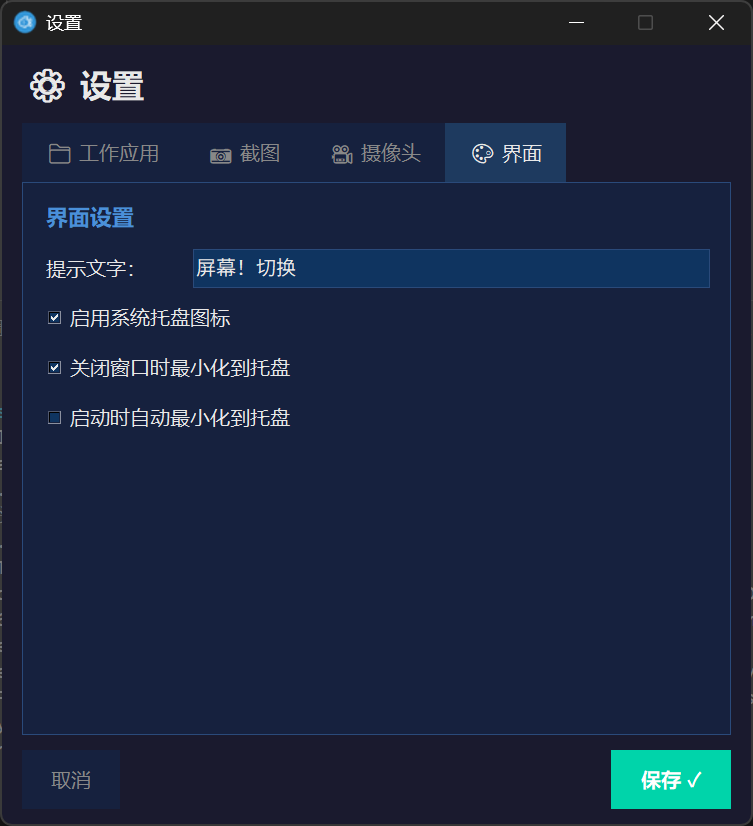

# 魔芋 (MoYu) 🛡️👀

**魔芋**是一款轻量级跨平台（Windows / macOS）的"防偷窥"小工具：通过摄像头实时检测画面中是否出现多张人脸，触发后会自动切换到工作软件，并可抓拍留证。

> 🎉 **v1.1.0 更新**: 全新图形化配置界面，让设置更加简单直观！

## ✨ 功能亮点

- 📸 **MediaPipe 高精度人脸检测**：支持多帧稳定判断，默认"多人同屏"才触发
- 🪟 **顶层小预览窗**：可移动/缩放，检测到人脸时显示提示文字
- 💾 **抓拍留存**：触发时保存当前画面到自定义目录
- 🔀 **自动切 App**：按配置激活 VSCode / IDEA 等常用软件
- 🔔 **托盘提醒**：可最小化到系统托盘，报警时弹出气泡提示
- ⚙️ **图形化设置**：全新的可视化配置界面，无需手动编辑配置文件
- 🧙 **配置向导**：首次启动引导完成基本设置

---

## 🖼️ 软件界面

### 配置向导
首次启动时，魔芋会自动弹出配置向导，帮助您快速完成初始设置：

<p align="center">
  
</p>

- ⚡ **快速选择**：一键选择常用工作应用（IDEA、VSCode、浏览器、WPS）
- 📝 **自定义配置**：手动输入应用名称和程序路径
- 📸 **截图配置**：启用自动截图并设置保存位置

### 设置面板
通过托盘图标右键菜单或主界面打开设置，进行详细配置：

#### 📁 工作应用管理
管理检测到人脸时要切换到的工作应用程序：

<p align="center">
  
</p>

- 添加/删除工作应用
- 设置默认切换应用
- 配置窗口关键字用于精确匹配

#### 📸 截图设置
配置自动截图功能：

<p align="center">
  
</p>

- 启用/禁用人脸检测时自动截图
- 自定义截图保存目录

#### 🎥 摄像头设置
调整摄像头和检测参数：

<p align="center">
  
</p>

- **摄像头编号**：选择使用的摄像头（默认 0）
- **触发人脸数**：设置触发切换所需的最少人脸数（默认 2）
- **冷却时间**：两次触发之间的间隔秒数
- **显示调试框**：在画面上绘制人脸检测框

#### 🎨 界面设置
自定义界面显示和行为：

<p align="center">
  
</p>

- **提示文字**：检测到人脸时显示的文字
- **系统托盘**：启用/禁用托盘图标
- **最小化行为**：关闭窗口时最小化到托盘
- **启动行为**：启动时自动最小化

---

## 📁 项目结构

```
moyu/
├── main.py              # 程序入口
├── config.yml           # 默认配置文件
├── main.spec            # PyInstaller 打包配置
├── requirements.txt     # Python 依赖
│
├── core/                # 核心功能模块
│   ├── constants.py     # 常量定义
│   ├── deps.py          # 依赖导入（兼容处理）
│   ├── paths.py         # 路径工具
│   ├── config_loader.py # 配置加载与合并
│   └── detector.py      # MediaPipe 人脸检测线程
│
├── services/            # 业务服务模块
│   ├── snapshot.py      # 抓拍保存服务
│   └── work_app.py      # 工作应用切换服务
│
├── ui/                  # 界面模块
│   ├── dpi_utils.py     # DPI 缩放工具
│   ├── settings_dialog.py # 设置对话框
│   ├── setup_wizard.py  # 配置向导
│   ├── splash.py        # 启动画面
│   ├── tray.py          # 系统托盘管理
│   ├── ui_app.py        # GUI 预览窗口
│   └── headless.py      # 无界面模式
│
└── docs/                # 文档资源
    └── screenshots/     # 软件截图
```

## 🛠️ 环境准备

### 1. 安装 Python 3.9+
- **Windows**：推荐官方安装包
- **macOS**：`brew install python`

### 2. 克隆并安装依赖

```bash
git clone https://github.com/x7722/moyu.git
cd moyu
python -m pip install -r requirements.txt
```

> macOS 用 `python3` 命令

## 🚀 源码运行

```bash
python main.py
```

首次运行需允许摄像头权限。程序会弹出配置向导帮助您完成初始设置。

## 🧩 配置说明

### 图形化配置（推荐）
通过托盘图标右键菜单 → **设置** 打开图形化配置界面，所有设置都可以可视化完成。

### 配置文件覆盖
程序启动时先加载内置的 `config.yml`，再尝试读取 exe 同目录的外部配置文件进行覆盖。

#### 常用字段
| 字段 | 说明 | 默认值 |
|------|------|--------|
| `min_faces_for_alert` | 触发所需最少人脸数 | 2 |
| `alert_cooldown_seconds` | 两次触发间的冷却秒数 | 15 |
| `snapshot.enabled` | 是否启用抓拍 | true |
| `snapshot.directory` | 抓拍保存目录 | snapshots |
| `work_app.active` | 当前生效的目标应用 | vscode |
| `ui.enable_system_tray` | 启用系统托盘 | true |
| `ui.minimize_to_tray` | 关闭时最小化到托盘 | true |

#### 覆盖示例
```yaml
min_faces_for_alert: 1
work_app:
  active: idea
  targets:
    idea:
      windows_command: "C:/Program Files/JetBrains/IntelliJ IDEA/bin/idea64.exe"
snapshot:
  enabled: true
  directory: snapshots
```

## 📦 打包

### Windows
```bash
python -m pip install pyinstaller
pyinstaller main.spec
```
产物位于 `dist/moyu.exe`

### macOS
```bash
python3 -m pip install pyinstaller
python3 -m PyInstaller --onefile --noconsole --name moyu --add-data "config.yml:." --collect-data mediapipe main.py
```
产物为 `dist/moyu`

## ❓ 常见问题

| 问题 | 解决方案 |
|------|----------|
| 看不到日志 | `--noconsole` 版本不会输出日志，去掉该参数重新打包 |
| 触发却无抓拍 | 确认截图已启用，保存目录可写 |
| 摄像头打不开 | 关闭占用摄像头的软件，检查系统权限 |

---

<p align="center">
  <b>尽情使用，欢迎反馈体验！</b> 🎉
</p>

## 📄 许可证

MIT License
